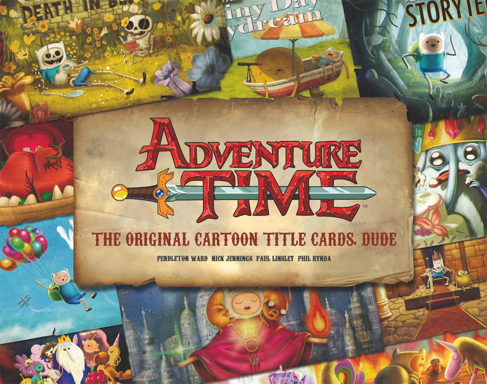

# AdventureTime
**Tara, Trinity, and Colin** are doing a project using the dialogue from Adventure Time for DIGIT 210. 


**Short Background**

Adventure time is an animated tv series created by Pendleton Ward. 
The show aired in 2010 and spanned 10 seasons. The show is considered to
be on of Cartoon Network's most influential shows. It has a massive fanbase and won mutiple awards.

# Our Main Question: 
Can we identify which character is speaking based only on dialogue patterns?
We would analyze **3–5** specific characters and compare their language use across episodes.
Some patterns we could look at: Word frequency, catchphrase detection, sentence length, emotional tone.
The goal would be to see if characters have distinct linguistic “fingerprints” that a computer can recognize, even without their names attached to the dialogue.

**This website provides scripts:** 
Category:Transcripts | Adventure Time Wiki | Fandom
We could also visualize the differences using word frequency charts, sentence length graphs, or clustering comparisons between characters.


**Script Notation**

Our original texts will be labled like so
```
ATE(# of the episode).txt
```
AT for Adventure Time and E for Episode. This will be followed by the epidsode number.

For xml files 
```
ATE1.xml
```
# Here is the link to the scripts: https://adventuretime.fandom.com/wiki/Category:Transcripts.

